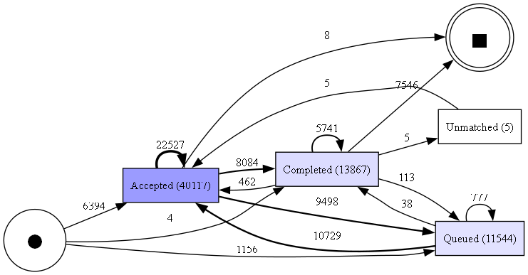
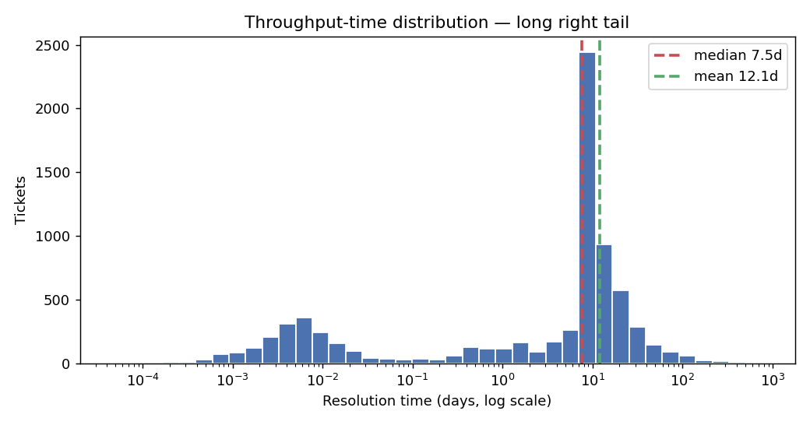
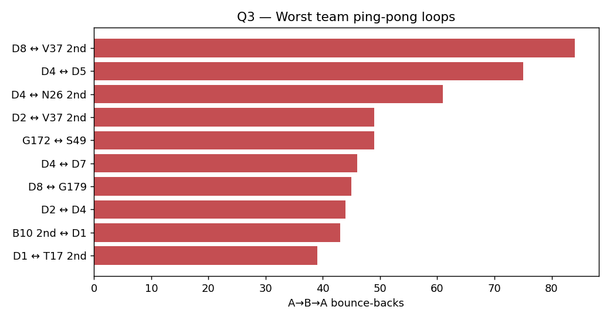
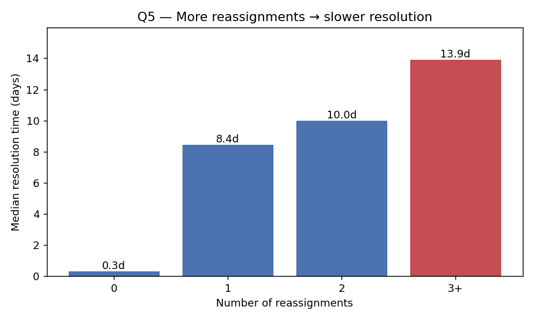

# After-Sales Service Process Mining

**Mining a real service-ticket event log to find where tickets bounce, stall, and reopen — framed as an analog for appliance after-sales service.**

I took a public IT service-desk event log (BPI Challenge 2013 — Volvo IT incident management,
**7,554 tickets / 65,533 events**) and ran a process-mining analysis on it as a stand-in for an
**appliance after-sales service process**. The event structure — ticket lifecycle, reassignments,
reopens, SLA waits — is identical to what an HVAC/appliance service network generates, so the
operational findings transfer directly.

📓 **Full analysis:** [`notebooks/after_sales_process_mining.ipynb`](notebooks/after_sales_process_mining.ipynb)

---

## Three findings

1. **Reassignment — not complexity — drives the slow tail.** Tickets reassigned 3+ times took a
   **13.9-day median to resolve vs 0.3 days** for never-reassigned ones (Spearman r = 0.56), and
   the effect **holds within every severity level**. → *Wrong-team routing / repeat technician
   dispatch is the dominant slowdown — fix the routing, not the technicians.*

2. **1 in 4 tickets (25%) is never formally resolved** — they end "on a call", in a wait state, or
   in the queue, never stamped `Resolved`/`Closed`. → *Invisible service work that silently
   corrupts every SLA and first-time-fix metric.*

3. **6.9% of resolved tickets were reopened** (first-time-fix ≈ 93%), with a tail bouncing back up
   to 6 times. → *Every reopen is a second truck-roll — the #1 hidden cost in field service and a
   direct threat to AMC renewal.*

---

## What the analysis answers (5 service-ops KPIs)

| # | Question | Result |
|---|----------|--------|
| 1 | **Happy-path conformance** — how many tickets follow the clean path? | 0% exact across **2,278 distinct paths**; 93% soft-conformant |
| 2 | **First-time-fix / reopen rate** | **6.9%** of resolved tickets reopened |
| 3 | **Biggest ping-pong loop** — worst team↔team bounce | **15.6%** of tickets ping-pong; worst pair bounced **84×** |
| 4 | **The bottleneck** — longest operational wait | Waiting on the **customer/user** (~19,300 cumulative days), *not* queue assignment |
| 5 | **The driver** — does reassignment predict resolution time? | Yes — Spearman **0.56**, ladder holds within severity |

## Visuals

| Discovered process map | Resolution-time distribution |
|---|---|
|  |  |
| **Worst ping-pong loops** | **Reassignment → resolution time** |
|  |  |

---

## Method & honesty note

A public IT-service-desk log is used as a stand-in for an appliance after-sales process. The
transfer is the point: process mining reads any timestamped event log the same way, and the
pathologies it surfaces (rework, ping-pong, reopens, waiting on customer/parts) are exactly the
ones that leak margin in field service.

**Translation layer used throughout:**

| IT service-desk reality | Appliance after-sales analog |
|---|---|
| `org:group` handover | Ticket reassigned / wrong team / repeat technician dispatch |
| `Wait - User` / `Wait - Vendor` | Waiting on the customer / waiting on spare parts |
| Resolved → reopened | Repeat complaint, not first-time-fixed |
| Throughput time | Resolution time vs SLA |

A note on rigor: the "bottleneck" excludes the administrative Resolved→Closed cooldown (a fixed
auto-close wait, not an operational delay), the reopen denominator is *resolved* tickets only, and
the reassignment driver is controlled for ticket severity before claiming it isn't a complexity proxy.

## Tools

PM4Py · pandas · scipy · matplotlib · Jupyter — all free, all Python (no Celonis license needed).

## Reproduce

```bash
python -m venv venv
venv\Scripts\activate            # Windows  (source venv/bin/activate on macOS/Linux)
pip install -r requirements.txt

# Download the event log (~1.3 MB) into data/ :
#   BPI Challenge 2013, incidents  —  https://doi.org/10.4121/500573e6-accc-4b0c-9576-aa5468b10cee
#   save as: data/BPI_Challenge_2013_incidents.xes.gz

jupyter notebook notebooks/after_sales_process_mining.ipynb
```

Graphviz (system binary) is required to render the process map.

---

*Dataset: BPI Challenge 2013, incidents (Volvo IT) — Steeman, W. (2013), 4TU.ResearchData,
[doi:10.4121/500573e6-accc-4b0c-9576-aa5468b10cee](https://doi.org/10.4121/500573e6-accc-4b0c-9576-aa5468b10cee).*
